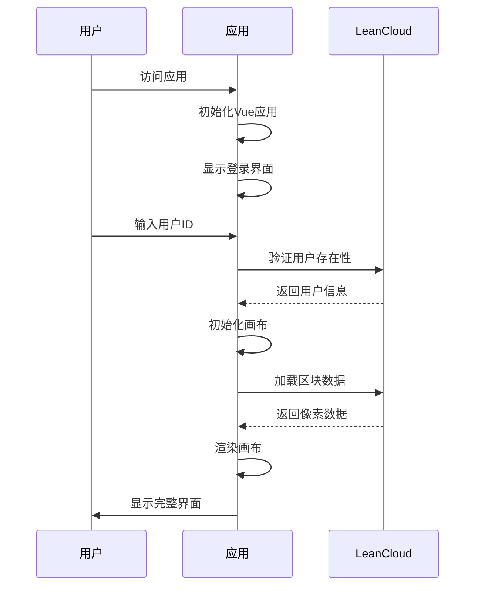
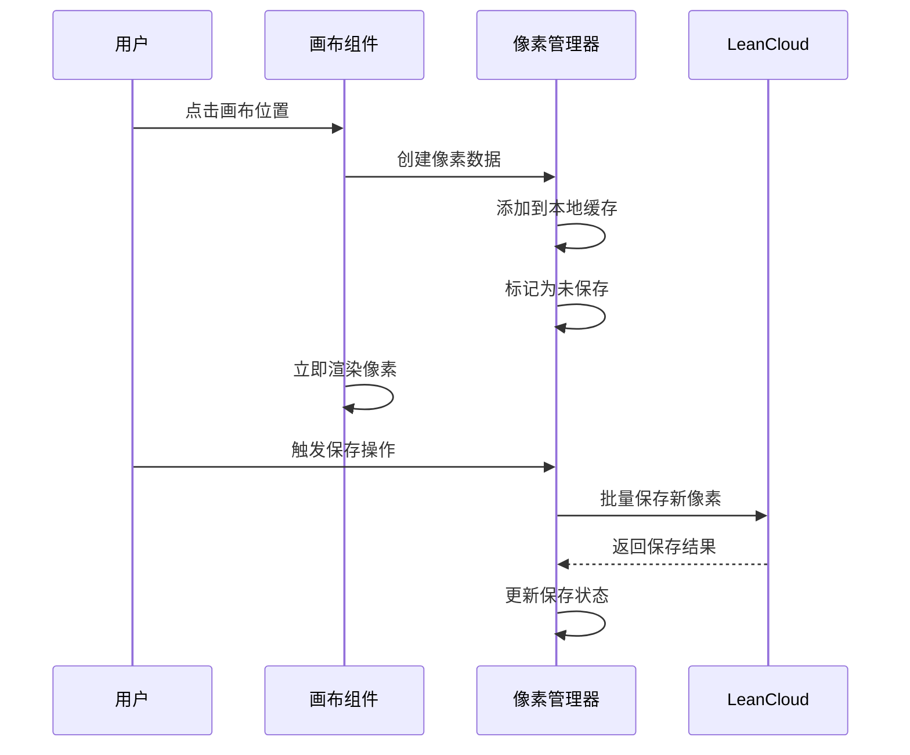

# SAR Map Pixel 项目架构文档

## 🚀 项目概述

SAR Map Pixel 是一个突破性的实时协作像素艺术平台，基于 Vue 3 和创新的**四区块系统架构**构建。采用现代化的前端技术栈和云端数据存储，为用户提供高性能、流畅的多人协作绘画体验。

### 🎯 核心特性
- **四区块系统**: 创新的区块划分架构，优化大规模像素数据管理
- **智能缓存**: 本地缓存 + 云端同步，极速响应用户操作
- **增量保存**: 只传输变更数据，大幅减少网络负载
- **实时协作**: 多用户同时在线，像素变更即时同步
- **精确权限**: 用户像素归属管理，保护创作安全

## 🏗️ 整体架构

```
┌─────────────────────────────────────────────────────────────────────┐
│                        前端应用层 (Vue 3)                           │
├─────────────────────────────────────────────────────────────────────┤
│  画布渲染  │  工具系统  │  用户界面  │  模态框  │  状态管理  │  国际化  │
├─────────────────────────────────────────────────────────────────────┤
│                          业务逻辑层                                 │
├─────────────────────────────────────────────────────────────────────┤
│  四区块系统  │  像素管理  │  用户认证  │  缓存机制  │  数据同步  │  错误处理  │
├─────────────────────────────────────────────────────────────────────┤
│                          数据服务层                                 │
├─────────────────────────────────────────────────────────────────────┤
│                      LeanCloud 云端数据库                           │
│  用户表  │  Chunk A  │  Chunk B  │  Chunk C  │  Chunk D  │  系统配置  │
└─────────────────────────────────────────────────────────────────────┘
```

### 🔄 数据流架构

```
用户操作 → 本地缓存 → 四区块管理器 → 增量同步 → LeanCloud → 实时更新
    ↓         ↓           ↓            ↓           ↓         ↓
  UI响应   即时渲染   智能分区    网络优化    数据持久化   协作同步
```

## 核心模块详解

### 1. 前端应用层

#### 主要组件结构

```
src/
├── App.vue                 # 根组件
├── views/
│   └── Map.vue            # 主画布视图
├── components/
│   ├── BaseModal.vue      # 基础模态框
│   ├── LoginModal.vue     # 登录界面
│   ├── HelpModal.vue      # 帮助页面
│   ├── AboutModal.vue     # 关于页面
│   ├── ErrorDisplay.vue   # 错误显示
│   ├── GlobalLoading.vue  # 全局加载
│   └── LanguageSwitcher.vue # 语言切换
└── services/              # 业务服务
```

#### 技术栈

- **框架**: Vue 3 (Composition API)
- **构建工具**: Vite
- **路由**: Vue Router
- **国际化**: Vue I18n
- **样式**: 原生 CSS

### 2. 业务逻辑层

#### 🎨 像素数据结构

```javascript
// 增强的像素数据结构
const pixelData = {
  x: Number,           // X坐标 (0-399)
  y: Number,           // Y坐标 (0-399)
  color: String,       // 颜色值 (#RRGGBB)
  userId: String,      // 用户ID (唯一标识)
  timestamp: Date,     // 创建时间
  chunkId: String,     // 所属区块ID (A/B/C/D)
  pixelSize: Number    // 像素大小 (默认16x16)
}

// 区块数据结构
const chunkData = {
  id: String,          // 区块标识 (A/B/C/D)
  bounds: {
    minX: Number,      // 最小X坐标
    maxX: Number,      // 最大X坐标
    minY: Number,      // 最小Y坐标
    maxY: Number       // 最大Y坐标
  },
  pixels: Map,         // 像素数据映射
  loaded: Boolean,     // 加载状态
  cached: Boolean      // 缓存状态
}
```

#### 用户认证流程

1. **用户输入ID** → 验证格式
2. **检查用户存在性** → LeanCloud查询
3. **创建/登录用户** → 更新登录时间
4. **初始化用户会话** → 加载用户数据

#### 🌐 四区块系统架构

**区块划分策略**:
- **Chunk A**: 坐标范围 (0-199, 0-199) - 左上区块
- **Chunk B**: 坐标范围 (200-399, 0-199) - 右上区块  
- **Chunk C**: 坐标范围 (0-199, 200-399) - 左下区块
- **Chunk D**: 坐标范围 (200-399, 200-399) - 右下区块

**核心优势**:
- 🚀 **性能提升**: 从64个请求减少到4个请求
- 💾 **内存优化**: 按需加载，减少内存占用
- ⚡ **响应速度**: 智能缓存，极速数据访问
- 🔄 **并发处理**: 多区块并行加载和更新

详见 [四区块系统技术文档](./chunk-system.md)

### 3. 数据服务层

#### 🗄️ LeanCloud 数据库设计

**用户表 (User)**

```javascript
{
  objectId: String,        // LeanCloud系统ID
  userId: String,          // 用户自定义ID (唯一)
  lastLoginTime: Date,     // 最后登录时间
  sessionCount: Number,    // 会话次数
  totalPixels: Number,     // 总像素数
  createdAt: Date,         // 创建时间
  updatedAt: Date          // 更新时间
}
```

**四区块数据表 (chunk_A, chunk_B, chunk_C, chunk_D)**

```javascript
{
  objectId: String,        // LeanCloud系统ID
  x: Number,              // 像素X坐标 (区块内相对坐标)
  y: Number,              // 像素Y坐标 (区块内相对坐标)
  color: String,          // 颜色值 (#RRGGBB)
  userId: String,         // 创建用户ID
  pixelSize: Number,      // 像素大小 (默认16)
  chunkId: String,        // 区块标识 (A/B/C/D)
  createdAt: Date,        // 创建时间
  updatedAt: Date         // 更新时间
}
```

**系统配置表 (SystemConfig)**

```javascript
{
  objectId: String,        // LeanCloud系统ID
  key: String,            // 配置键名
  value: String,          // 配置值
  description: String,    // 配置描述
  updatedAt: Date         // 更新时间
}
```

## 核心工作流程

### 1. 应用启动流程



### 2. 像素绘制流程



### 3. 数据同步机制

#### 智能保存策略

- **增量保存**: 只保存新增像素，避免重复传输
- **批量操作**: 将多个像素打包为一次请求
- **状态跟踪**: 实时显示未保存更改状态
- **错误重试**: 保存失败时提供重试机制

#### 数据加载优化

- **区块分割**: 画布分为4个大区块独立加载
- **按需加载**: 只加载当前视图需要的数据
- **缓存机制**: 已加载数据缓存在内存中
- **渐进式加载**: 区块按顺序依次加载

## ⚡ 性能优化策略

### 1. 🎨 前端性能优化

#### 渲染优化

- **Canvas 渲染**: 使用 HTML5 Canvas 进行高效像素渲染
- **视图裁剪**: 只渲染可视区域内的像素，减少绘制开销
- **批量更新**: 将多个像素更新合并为一次渲染操作
- **防抖处理**: 用户操作防抖，避免频繁更新和重绘
- **像素缓存**: 预渲染常用像素块，提升绘制速度
- **分层渲染**: 背景和前景分离渲染，优化更新效率

#### 内存管理

- **数据结构优化**: 使用 Map 结构存储像素数据，提升查找效率
- **垃圾回收**: 及时清理不需要的数据引用，防止内存泄漏
- **懒加载**: 组件和资源按需加载，减少初始内存占用
- **对象池**: 复用像素对象，减少频繁创建销毁
- **弱引用**: 使用 WeakMap 存储临时数据，自动垃圾回收

### 2. 🌐 网络性能优化

#### 请求优化

- **四区块加载**: 从64个请求减少到4个请求，大幅提升加载速度
- **增量同步**: 只传输变更的像素数据，减少网络负载
- **数据压缩**: 传输数据进行 gzip 压缩处理
- **请求合并**: 多个像素操作合并为单次批量请求
- **智能缓存**: 本地缓存 + HTTP缓存双重策略
- **预加载**: 预测用户行为，提前加载相关区块
- **CDN加速**: 静态资源通过CDN分发，提升访问速度

#### 错误处理与容错

- **指数退避重试**: 网络错误智能重试，避免服务器压力
- **降级策略**: 部分功能失败不影响核心绘制功能
- **离线支持**: 网络断开时支持本地绘制，恢复后同步
- **用户反馈**: 清晰的错误信息和解决建议
- **自动恢复**: 检测到网络恢复后自动重新连接

## 🎯 用户体验设计

### 1. 🖱️ 交互设计

#### 直观操作

- **所见即所得**: 点击即绘制，实时预览绘制效果
- **智能工具栏**: 简洁直观的工具切换界面
- **快捷键支持**: 丰富的键盘快捷键，提升操作效率
- **触摸优化**: 移动设备友好的触摸操作和手势支持
- **取色器**: 支持画布取色和屏幕取色，实时预览
- **历史颜色**: 自动记录最近使用的10种颜色

#### 视觉反馈

- **像素预览**: 鼠标悬停显示绘制预览和坐标信息
- **状态指示**: 清晰的保存状态提示（红色圆点表示未保存）
- **加载动画**: 优雅的区块加载进度展示
- **错误提示**: 友好的错误信息显示和解决建议
- **操作反馈**: 每个操作都有即时的视觉反馈
- **像素统计**: 实时显示总像素数和用户贡献

### 2. 📱 响应式设计

#### 多设备适配

- **桌面端**: 完整功能体验，支持精确鼠标操作
- **平板端**: 触摸优化界面，支持双指缩放和拖拽
- **手机端**: 简化操作流程，优化小屏幕体验
- **跨浏览器**: 主流浏览器兼容（Chrome、Firefox、Safari、Edge）
- **高DPI支持**: 适配高分辨率屏幕，确保清晰显示
- **横竖屏适配**: 自动适应设备方向变化

## 🌍 国际化支持

### 多语言架构

```
src/i18n/
├── i18n.js              # Vue I18n 配置文件
└── locales/
    ├── zh.json          # 简体中文 (默认)
    ├── en.json          # 英文
    └── tc.json          # 繁体中文
```

### 本地化策略

- **完整翻译**: 界面文本、提示信息、错误消息完全本地化
- **动态切换**: 运行时语言切换，无需刷新页面
- **自动检测**: 根据浏览器语言自动选择合适的语言
- **文化适配**: 考虑不同文化的使用习惯和表达方式
- **可扩展性**: 易于添加新语言支持
- **回退机制**: 缺失翻译时自动回退到默认语言

## 安全性考虑

### 1. 数据安全

- **用户隔离**: 用户只能修改自己的像素
- **输入验证**: 严格的数据格式验证
- **XSS防护**: 防止跨站脚本攻击
- **CSRF保护**: 防止跨站请求伪造

### 2. 隐私保护

- **最小化数据**: 只收集必要的用户信息
- **数据加密**: 敏感数据传输加密
- **访问控制**: 严格的数据访问权限
- **数据清理**: 定期清理过期数据

## 监控与维护

### 1. 性能监控

- **加载时间**: 监控应用启动和数据加载时间
- **渲染性能**: 跟踪画布渲染帧率
- **网络请求**: 监控API请求成功率和响应时间
- **错误率**: 统计各类错误的发生频率

### 2. 用户行为分析

- **使用统计**: 分析用户操作习惯
- **功能使用率**: 评估各功能的使用频率
- **设备分布**: 了解用户设备和浏览器分布
- **地理分布**: 分析用户地理位置分布

## 部署与运维

### 1. 构建流程

```bash
# 安装依赖
npm install

# 开发环境
npm run dev

# 生产构建
npm run build

# 预览构建结果
npm run preview
```

### 2. 部署策略

- **静态部署**: 构建后的静态文件部署到CDN
- **版本控制**: 使用Git进行代码版本管理
- **自动化部署**: CI/CD流水线自动部署
- **回滚机制**: 快速回滚到稳定版本

### 3. 环境配置

- **开发环境**: 本地开发和调试
- **测试环境**: 功能测试和集成测试
- **预发布环境**: 生产前最后验证
- **生产环境**: 正式用户访问环境

## 未来发展规划

### 1. 功能扩展

- **实时协作**: WebSocket实时同步
- **版本历史**: 像素修改历史记录
- **团队协作**: 多人团队项目管理
- **模板系统**: 预设图案和模板

### 2. 技术升级

- **PWA支持**: 渐进式Web应用
- **WebGL渲染**: 更高性能的图形渲染
- **WebAssembly**: 计算密集型任务优化
- **微前端**: 模块化架构升级

### 3. 生态建设

- **插件系统**: 第三方插件支持
- **API开放**: 开放API供第三方集成
- **社区建设**: 用户社区和作品分享
- **移动应用**: 原生移动应用开发

## 总结

SAR Map Pixel 通过现代化的前端架构、优化的数据管理和用户友好的交互设计，为用户提供了一个高性能、易用的协作像素艺术平台。项目采用模块化设计，具有良好的可扩展性和维护性，为未来的功能扩展和技术升级奠定了坚实基础。

通过4区块加载系统、智能保存机制和完善的错误处理，项目在性能和用户体验方面都达到了较高水准，展示了现代Web技术在实时协作应用中的强大能力。
