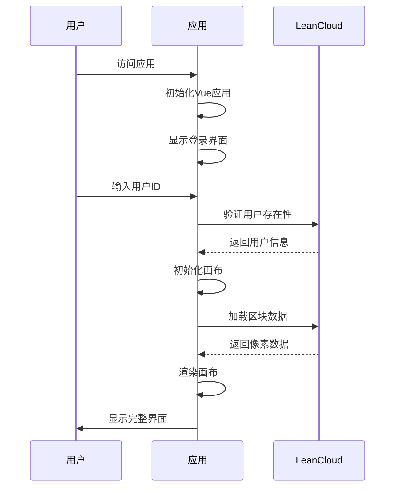
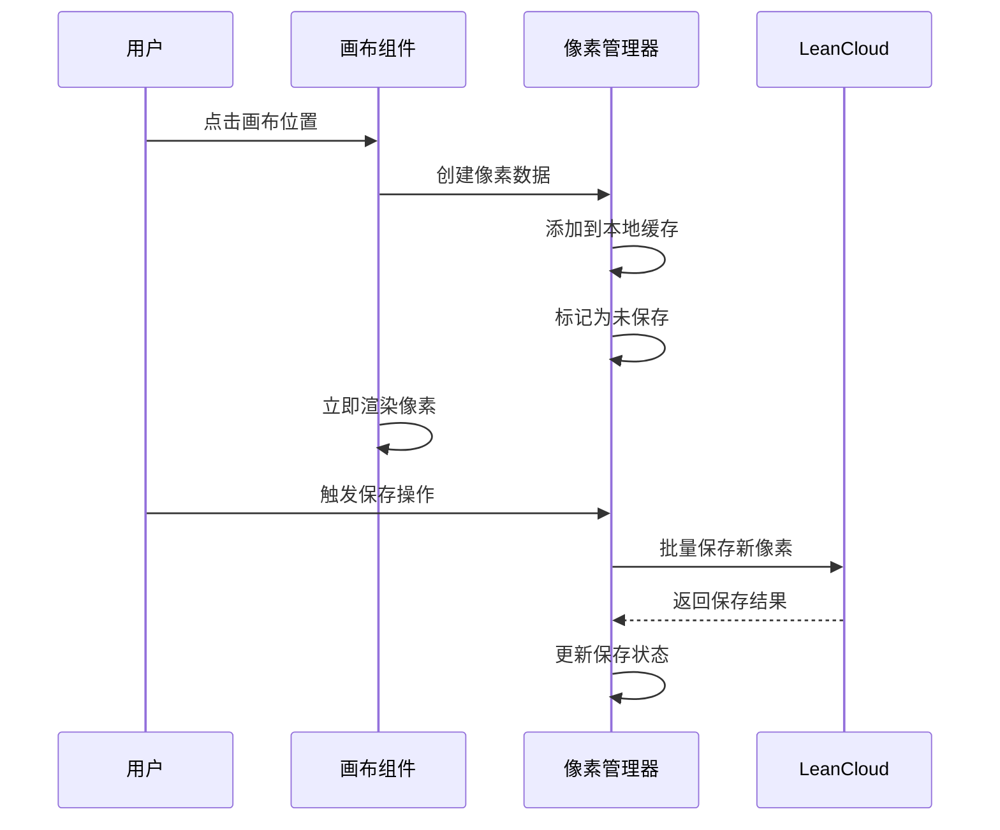

# SAR Map Pixel 项目架构与运作方式

## 项目概述

SAR Map Pixel 是一个基于 Vue 3 的实时协作像素艺术平台，采用现代化的前端架构和云端数据存储，为用户提供流畅的多人协作绘画体验。

## 整体架构

┌─────────────────────────────────────────────────────────────┐
│                    前端应用层 (Vue 3)                        │
├─────────────────────────────────────────────────────────────┤
│  用户界面  │  画布渲染  │  工具栏  │  模态框  │  状态管理    │
├─────────────────────────────────────────────────────────────┤
│                    业务逻辑层                                │
├─────────────────────────────────────────────────────────────┤
│  像素管理  │  用户认证  │  数据同步  │  区块加载  │  错误处理  │
├─────────────────────────────────────────────────────────────┤
│                    数据服务层                                │
├─────────────────────────────────────────────────────────────┤
│              LeanCloud 云端数据库                           │
└─────────────────────────────────────────────────────────────┘

## 核心模块详解

### 1. 前端应用层

#### 主要组件结构

```
src/
├── App.vue                 # 根组件
├── views/
│   └── Map.vue            # 主画布视图
├── components/
│   ├── BaseModal.vue      # 基础模态框
│   ├── LoginModal.vue     # 登录界面
│   ├── HelpModal.vue      # 帮助页面
│   ├── AboutModal.vue     # 关于页面
│   ├── ErrorDisplay.vue   # 错误显示
│   ├── GlobalLoading.vue  # 全局加载
│   └── LanguageSwitcher.vue # 语言切换
└── services/              # 业务服务
```

#### 技术栈

- **框架**: Vue 3 (Composition API)
- **构建工具**: Vite
- **路由**: Vue Router
- **国际化**: Vue I18n
- **样式**: 原生 CSS

### 2. 业务逻辑层

#### 像素管理系统

```javascript
// 像素数据结构
const pixelData = {
  x: Number,        // X坐标
  y: Number,        // Y坐标
  color: String,    // 颜色值 (#RRGGBB)
  userId: String,   // 用户ID
  timestamp: Date   // 创建时间
}
```

#### 用户认证流程

1. **用户输入ID** → 验证格式
2. **检查用户存在性** → LeanCloud查询
3. **创建/登录用户** → 更新登录时间
4. **初始化用户会话** → 加载用户数据

#### 4区块加载系统

详见 [4区块系统技术文档](./4-chunk-system.md)

### 3. 数据服务层

#### LeanCloud 数据库设计

**用户表 (User)**

```
字段:
- objectId: 系统ID
- userId: 用户自定义ID
- lastLoginTime: 最后登录时间
- createdAt: 创建时间
- updatedAt: 更新时间
```

**区块数据表 (chunk_0, chunk_1, chunk_2, chunk_3)**

```
字段:
- objectId: 系统ID
- x: 像素X坐标
- y: 像素Y坐标
- color: 颜色值
- userId: 创建用户ID
- createdAt: 创建时间
- updatedAt: 更新时间
```

## 核心工作流程

### 1. 应用启动流程



### 2. 像素绘制流程



### 3. 数据同步机制

#### 智能保存策略

- **增量保存**: 只保存新增像素，避免重复传输
- **批量操作**: 将多个像素打包为一次请求
- **状态跟踪**: 实时显示未保存更改状态
- **错误重试**: 保存失败时提供重试机制

#### 数据加载优化

- **区块分割**: 画布分为4个大区块独立加载
- **按需加载**: 只加载当前视图需要的数据
- **缓存机制**: 已加载数据缓存在内存中
- **渐进式加载**: 区块按顺序依次加载

## 性能优化策略

### 1. 前端性能优化

#### 渲染优化

- **Canvas 渲染**: 使用 HTML5 Canvas 进行高效像素渲染
- **视图裁剪**: 只渲染可视区域内的像素
- **批量更新**: 将多个像素更新合并为一次渲染
- **防抖处理**: 用户操作防抖，避免频繁更新

#### 内存管理

- **数据结构优化**: 使用 Map 结构存储像素数据
- **垃圾回收**: 及时清理不需要的数据引用
- **懒加载**: 组件和资源按需加载

### 2. 网络性能优化

#### 请求优化

- **区块加载**: 从64个请求减少到4个请求
- **数据压缩**: 传输数据进行压缩处理
- **请求合并**: 多个操作合并为单次请求
- **缓存策略**: 合理利用浏览器缓存

#### 错误处理

- **重试机制**: 网络错误自动重试
- **降级策略**: 部分功能失败不影响整体使用
- **用户反馈**: 清晰的错误信息和解决建议

## 用户体验设计

### 1. 交互设计

#### 直观操作

- **所见即所得**: 点击即绘制，实时预览
- **工具切换**: 简单的工具栏设计
- **快捷键支持**: 常用操作的键盘快捷键
- **触摸支持**: 移动设备友好的触摸操作

#### 视觉反馈

- **像素预览**: 鼠标悬停显示绘制预览
- **状态指示**: 清晰的保存状态提示
- **加载动画**: 优雅的加载过程展示
- **错误提示**: 友好的错误信息显示

### 2. 响应式设计

#### 多设备适配

- **桌面端**: 完整功能体验
- **平板端**: 触摸优化界面
- **手机端**: 简化操作流程
- **跨浏览器**: 主流浏览器兼容

## 国际化支持

### 多语言架构

```
i18n/
├── i18n.js              # 国际化配置
└── locales/
    ├── zh.json          # 简体中文
    ├── en.json          # 英文
    └── zh-TW.json       # 繁体中文
```

### 本地化策略

- **文本翻译**: 界面文本完全本地化
- **日期格式**: 根据地区显示日期格式
- **数字格式**: 本地化数字显示
- **文化适配**: 考虑不同文化的使用习惯

## 安全性考虑

### 1. 数据安全

- **用户隔离**: 用户只能修改自己的像素
- **输入验证**: 严格的数据格式验证
- **XSS防护**: 防止跨站脚本攻击
- **CSRF保护**: 防止跨站请求伪造

### 2. 隐私保护

- **最小化数据**: 只收集必要的用户信息
- **数据加密**: 敏感数据传输加密
- **访问控制**: 严格的数据访问权限
- **数据清理**: 定期清理过期数据

## 监控与维护

### 1. 性能监控

- **加载时间**: 监控应用启动和数据加载时间
- **渲染性能**: 跟踪画布渲染帧率
- **网络请求**: 监控API请求成功率和响应时间
- **错误率**: 统计各类错误的发生频率

### 2. 用户行为分析

- **使用统计**: 分析用户操作习惯
- **功能使用率**: 评估各功能的使用频率
- **设备分布**: 了解用户设备和浏览器分布
- **地理分布**: 分析用户地理位置分布

## 部署与运维

### 1. 构建流程

```bash
# 安装依赖
npm install

# 开发环境
npm run dev

# 生产构建
npm run build

# 预览构建结果
npm run preview
```

### 2. 部署策略

- **静态部署**: 构建后的静态文件部署到CDN
- **版本控制**: 使用Git进行代码版本管理
- **自动化部署**: CI/CD流水线自动部署
- **回滚机制**: 快速回滚到稳定版本

### 3. 环境配置

- **开发环境**: 本地开发和调试
- **测试环境**: 功能测试和集成测试
- **预发布环境**: 生产前最后验证
- **生产环境**: 正式用户访问环境

## 未来发展规划

### 1. 功能扩展

- **实时协作**: WebSocket实时同步
- **版本历史**: 像素修改历史记录
- **团队协作**: 多人团队项目管理
- **模板系统**: 预设图案和模板

### 2. 技术升级

- **PWA支持**: 渐进式Web应用
- **WebGL渲染**: 更高性能的图形渲染
- **WebAssembly**: 计算密集型任务优化
- **微前端**: 模块化架构升级

### 3. 生态建设

- **插件系统**: 第三方插件支持
- **API开放**: 开放API供第三方集成
- **社区建设**: 用户社区和作品分享
- **移动应用**: 原生移动应用开发

## 总结

SAR Map Pixel 通过现代化的前端架构、优化的数据管理和用户友好的交互设计，为用户提供了一个高性能、易用的协作像素艺术平台。项目采用模块化设计，具有良好的可扩展性和维护性，为未来的功能扩展和技术升级奠定了坚实基础。

通过4区块加载系统、智能保存机制和完善的错误处理，项目在性能和用户体验方面都达到了较高水准，展示了现代Web技术在实时协作应用中的强大能力。
